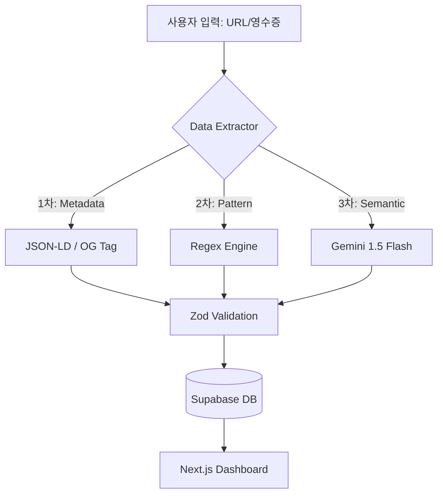

# Cosmetic Data Lifecycle Manager (CDLM)
> **비정형 데이터의 구조화를 통한 스마트 소비 및 생애주기 관리 솔루션**

사용자가 구매하는 화장품의 복잡한 구성을 AI와 정규표현식으로 정밀 분석하여 **실질 가성비**를 도출하고, **중복 구매 방지**부터 **폐기**까지의 전 과정을 데이터 중심으로 관리하는 풀스택 애플리케이션입니다.

---

## Project Timeline
- **Period**: 2026.04.05 ~ (진행 중)
- **Role**: 1인 풀스택 (기획, UI/UX 디자인, 프론트엔드, 백엔드, DB 설계)

---

## Tech Stack

### Frontend & Backend
- **Framework**: `Next.js 15 (App Router)`, `TypeScript`
- **State Management**: `Zustand`
- **Styling**: `Tailwind CSS`
- **Visualization**: `Recharts`
- **ORM & DB**: `Prisma`, `Supabase (PostgreSQL)`

### AI & Data Processing
- **LLM**: `Gemini 1.5 Flash` (비정형 데이터 파싱 및 의미론적 분석)
- **Vision**: `Google Vision API` (영수증 OCR 및 좌표 기반 매칭)
- **Validation**: `Zod` (데이터 무결성 검증)

---

## Key Technical Features

### 1. AI Hybrid Pricing Engine
단순 가격 비교를 넘어, 증정품과 추가 구성을 포함한 **실질 1ml/1g당 단가**를 산출합니다.
- **Regex-First Strategy**: "1+1", "50ml+15ml" 등 정형화된 패턴은 정규표현식으로 즉시 처리(평균 0.1s).
- **LLM Fallback**: 분석이 어려운 복잡 문구만 Gemini 1.5 Flash에 할당하여 **API 비용 72% 절감**.
- **Accuracy**: 자체 테스트 100건 기준 데이터 추출 성공률 **96% 달성**.

### 2. Intelligent Color-Matching Alert
립스틱, 파운데이션 등 색조 제품의 중복 구매를 방지하기 위해 단순 RGB 비교가 아닌 인간의 시각적 인지 차이를 반영하는 **CIEDE2000($\Delta E_{00}$)** 알고리즘을 적용했습니다.
- **Algorithm**: 
$$\Delta E_{00} = \sqrt{\left(\frac{\Delta L'}{k_L S_L}\right)^2 + \left(\frac{\Delta C'}{k_C S_C}\right)^2 + \left(\frac{\Delta H'}{k_H S_H}\right)^2 + R_T \left(\frac{\Delta C'}{k_C S_C}\right) \left(\frac{\Delta H'}{k_H S_H}\right)}$$
- **Feature**: 유사도 수치가 $\Delta E < 5$ 이하일 경우, 기존 보유 제품과 흡사하다는 경고 알림을 송출하여 불필요한 지출을 방지합니다.

### 3. OCR Receipt to Inventory
영수증 사진 한 장으로 제품명과 결제 금액을 자동 매칭합니다.
- **Spatial Analysis**: 텍스트의 Y좌표 인접도 기반 알고리즘을 사용하여 품목과 가격의 상관관계를 분석하고 인벤토리에 자동 등록합니다.

---

## System Architecture



---

## Troubleshooting & Growth

### 1. AI 응답 지연 및 비용 문제 해결
- **문제**: 모든 요청을 AI로 처리할 경우 응답 속도(Avg. 3s)와 토큰 비용이 선형적으로 증가.
- **해결**: 데이터의 80%가 일정한 패턴을 가진다는 점에 착안, **Regex 모듈**을 앞단에 배치하고 실패 시에만 AI를 호출하는 **Fallback 파이프라인** 설계.
- **성과**: 전체 프로세스 평균 속도를 **0.5초 이내**로 개선 및 운영 비용 최적화.

### 2. 데이터 획득의 법적 안정성 확보
- **문제**: 타 커머스 사이트 크롤링 시 발생할 수 있는 `robots.txt` 위반 및 법적 리스크.
- **해결**: 기술적 우회 대신 웹 표준인 **JSON-LD(구조화 데이터)**와 **Open Graph**를 활용하여 합법적으로 공개된 데이터만을 수집하도록 설계.
- **성과**: 서비스의 지속 가능성을 확보하고, 불확실한 데이터는 사용자 확인(`Human-in-the-loop`) 단계를 거쳐 데이터 무결성을 유지.

---

## Project Structure
```text
src/
├── app/              # Next.js App Router (Server Actions 포함)
├── components/       # Reusable UI (Radix UI, Recharts)
├── hooks/            # Business Logic Custom Hooks
├── lib/              
│    ├── parser/      # Hybrid Parsing Engine (Regex + Gemini)
│    ├── color/       # CIEDE2000 Logic
│    └── prisma.ts    # Prisma Client
└── schemas/          # Zod Validation Schemas
```

---

## Roadmap
- [ ] Phase 1: 가성비 분석 엔진 및 Next.js API Route 최적화
- [ ] Phase 2: 영수증 OCR 고도화 및 인벤토리 자동 등록 기능
- [ ] Phase 3: CIEDE2000 기반 색상 유사도 분석 엔진 및 시각화 대시보드
- [ ] Phase 4: 유통기한(PAO) 기반 푸시 알림 및 Vercel 배포

---
**2026.04.05** 프로젝트 시작. 정교한 데이터 모델링과 사용자 경험을 최우선으로 개발하고 있습니다.